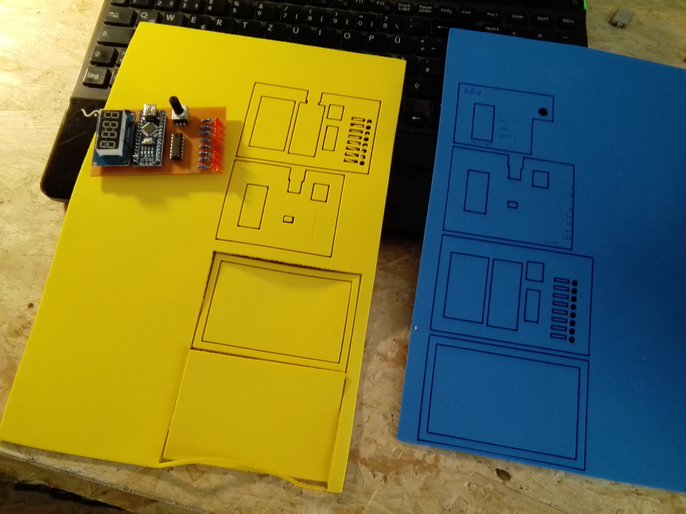
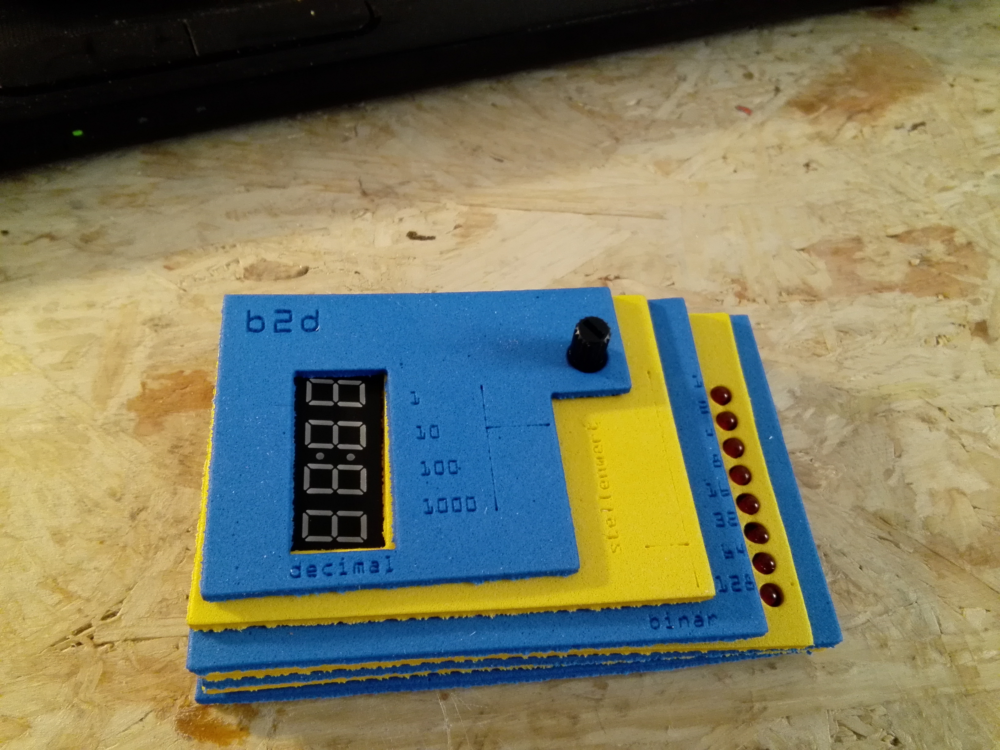
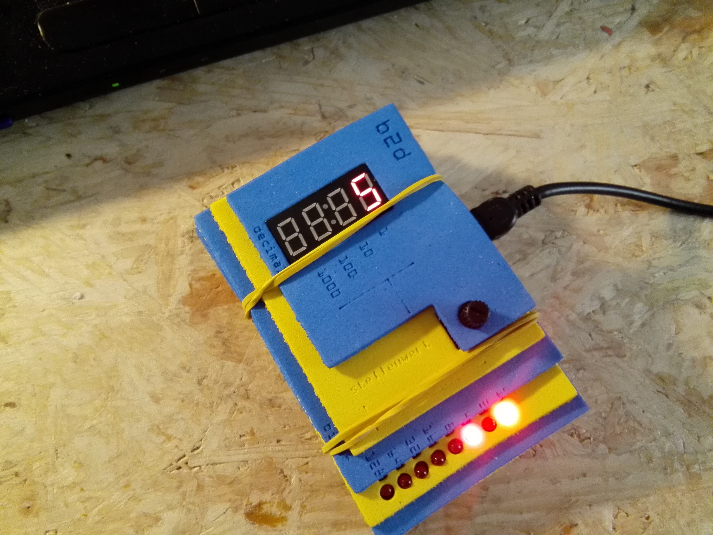

# b2d

Ein Projekt zur Erklärung des binären und decimalen Zahlensystems. 

 

# Produktion #

Platinenentwurf mit **Fritzing**.
Gefräst auf einer **Othermill**.

Gehäuseentwurf mit **SketchUp**. 
Gelasert auf einem **glowforce**.

Programmiert mit **Arduino**.

Entworfen und montiert im [erfindergarden](http://www.erfindergarden).

**Lasereinstellungen glowforce** für den 2 mm Schaumstoff:

- cut Hülle speed 300, power 35
- engrave Text speed 1000, power 10, lines 450
- cut Linie speed 500, power 1
 